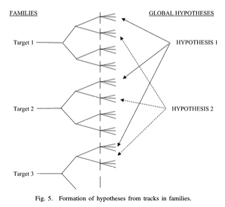

# TOMHT for ISAC - workshop 2026-03-30

Patrik Andersson
SafeRadar Research AB


---

# Outline of this session

- TO-MHT vs "simple" trackers (e.g., GNN) 
- TO-MHT data structures and update flow
- Current state of our implementation
- Integration
- Next steps

---

# Why MHT at all?

- Trackers need to explain the world in terms of associations:
  - Which detections originate from which target?
  - Which detections are clutter / false alarms?
- Simple trackers like GNN keep one current explanation of the world
- MHT keeps multiple plausible explanations alive over time
- This is useful when ambiguity cannot be resolved immediately
  - Dense scenarios, high clutter, low SNR, ...
- The price is more complexity and computational load
  - More state, more branching, more need for pruning/commitment, ...

---

# Design goals for our implementation

- Proper TO-MHT implementation
- Stone Soup based
  - Use standard Stone Soup APIs, without special hacks or assumptions
  - Should allow integration in any Stone Soup compliant environment
  - Abstracts away dependencies on measurement and transition models, etc
- Support ISAC use case
- Code should be easy to read and work with
- Prioritize clean architecture and code over raw performance
  - Algorithmic optimizations to keep branching under control still essential
  - Some code-level optimization to remove obvious inefficiencies is fine

---

# Public usage pattern for a simple Stone Soup tracker

```python
hypothesiser = PDAHypothesiser(predictor, updater, ...)
data_associator = GlobalNearestNeighbour(hypothesiser)

tracker = MultiTargetTracker(
    initiator=initiator,
    deleter=deleter,
    data_associator=data_associator,
    updater=updater,
)

for (time, detections) in source:
    time, tracks = tracker.update_tracker(time, detections)
```

or pass in a detector iterator to the constructor and say

```python
for (time, tracks) in tracker:
    ...
```

---

# Stone Soup MultiTargetTracker implementation

```python
class MultiTargetTracker(_TrackerMixInNext, Tracker):
    ...

    def __next__(self) -> tuple[datetime.datetime, set[Track]]:
        time, detections = next(self.detector_iter)

        associations = self.data_associator.associate(
            self.tracks, detections, time)
        associated_detections = set()
        for track, hypothesis in associations.items():
            if hypothesis:
                state_post = self.updater.update(hypothesis)
                track.append(state_post)
                associated_detections.add(hypothesis.measurement)
            else:
                track.append(hypothesis.prediction)

        self._tracks -= self.deleter.delete_tracks(self.tracks)
        self._tracks |= self.initiator.initiate(
            detections - associated_detections, time)

        return time, self.tracks
```

---

# Public usage pattern for our TO-MHT tracker

```python
tracker = TOMHTTracker(
    hypothesiser=...,
    updater=...,
    initiator=...,
    params=...,
)

for (time, detections) in source:
    time, tracks = tracker.update_tracker(time, detections)
```

Note: No `data_associator` since we're not making a single set of associations at each time step.

---

# Alternate usage pattern, with external track starts

```python
tracker = TOMHTTracker(
    hypothesiser=...,
    updater=...,
    initiator=None,
    params=...,
)

for (time, detections) in source:
    time, tracks = tracker.update_tracker(time, detections)

    unused_det = tracker.get_unused_detections()
    ... # Somehow generate track_starts from unused_det
    tracker.add_external_starts(time, track_starts)
```

---

# External starts

- Intended for externally confirmed starts
- Fits the ISAC workflow where other components do:
  - sensor tracks
  - correlation
  - ambiguity resolution
  - confirmed system track starts
- Those starts are injected after processing that same timestamp
- They enter the same data structures as internal births

---

# Conceptual core of TO-MHT

### TO-MHT as track trees + global hypotheses

- A TO-MHT keeps multiple plausible association histories alive over time
- Conceptually, each logical track is a **track tree** (aka family)
- Each node in that tree corresponds to one local association decision at one scan
- A **global hypothesis** selects one active leaf from each track tree, in a way that is globally consistent between tracks, including history:
  - no detection is used twice
  - clutter / births are handled consistently

---

# Track trees (or families) + global hypotheses



---

# Core TO-MHT pattern

This “local branching + global consistency” split is the core TO-MHT pattern.

- Ambiguity is stored **inside each track** as branching history
- Joint consistency is handled **across tracks** by global hypotheses
- Shared history is represented by parent links

---

# Conceptual core data structures

### Measurement / scan
- one batch of detections at one timestamp

### Track-hypothesis node
- one state estimate after one local association decision
- linked to its parent in the same logical track

### Track tree
- all competing histories for one logical target

### Global hypothesis
- one consistent joint choice of active leaves across trees

---

# Conceptual track-hypothesis node

Typical contents of a node:

- logical track identity
- parent pointer
- child pointers
- scan index / timestamp
- state estimate
- association type
  - detection, missed detection, birth / start
- measurement reference (if any)
- local score contribution

---

# Conceptual track tree

Typical contents:

- logical track identity
- root pointer
- leaf pointers
- metadata

Interpretation: 
- one tree per logical target
- leaves are the active competing hypotheses
- parent/child structure captures association history

---

# Conceptual global hypothesis

Core contents:

- selected leaf for each track
- log weight

---

# Conceptual update step

A typical track-oriented TO-MHT update step is:

1. predict active leaf hypotheses to the new detection time  
2. gate detections to form feasible local associations  
3. create per-track child hypotheses for matches, misses, and births  
4. prune weak local branches  
5. rebuild globally consistent hypotheses from the surviving track set  
6. score, prune, resolve older ambiguity, and output tracks

---

# Expand the track trees locally

For each active leaf, create child hypotheses for the feasible events after track prediction and detection gating.

Typical child types:

- one **measurement-update child** for each gated detection
- one **missed-detection child**
- maybe a termination child

Note: At this point, branching is still **local to each track tree**. Global consistency has not yet been enforced.

---

# Create possible birth tracks

Some detections may represent:

- clutter / false alarm
- new target birth

So the tracker may create tentative birth hypotheses from detections that are not obviously explained by existing tracks.

---

# Prune weak local branches

Before rebuilding global hypotheses, many implementations prune the track trees locally.

Typical local pruning:

- drop very low-score children
- cap the number of children per leaf
- delete branches with too many consecutive misses
- merge near-duplicates if the implementation supports it

---

# Determine compatibility among track hypotheses

Take the surviving candidate track hypotheses and determine which can coexist in the same global explanation.

Two track hypotheses are **incompatible** if they:

- use the same detection at the same scan, or
- descend from mutually exclusive alternatives in the same track tree

---

# Rebuild global hypotheses from the current track set

Form one or more best global hypothesis, i.e., **globally consistent sets** of track hypotheses.

The tracker may compute:

- the single best global hypothesis
- the top `K` global hypotheses
- a weighted set of feasible global explanations

Various methods have been suggested here.

---

# Scoring of the rebuilt global hypotheses

Each rebuilt global hypothesis gets a score from the scores of its member track hypotheses plus clutter/birth terms and any normalizing constants.

Because the track hypotheses already carry accumulated history-dependent scores, the global score can be assembled from the current selected tracks.

---

# Global pruning and N-scan resolution

After rebuilding the globals:

- keep only the top `K` globals or those above a threshold
- remove track branches not used by any surviving global if desired
- apply N-scan pruning / deferred decision logic, discarding branches that differ before the cutoff

This keeps ambiguity confined to a moving recent window.

---

# Lifecycle management and track output

Based on the surviving hypotheses, update track status:

- tentative -> confirmed
- confirmed -> coasted
- coasted too long -> deleted

Then generate user-facing output from:

- the single best global hypothesis, or
- a weighted combination of several globals

---

# Proper TO-MHT vs current implementation

### TO-MHT
- rebuild globals from track trees at each scan

### Current implementation
- internal data structures have been updated towards a proper TO-MHT
- we maintain node-based track hypotheses
- track trees are implicit
- the update mechanics still retain some global-hypothesis-oriented structure, evolving an explicit set of current global hypotheses scan to scan

---

# What the current implementation stores

### `TrackHypothesisNode`
One logical-track hypothesis at one scan step.

Carries:
- same-track parent link
- state payload
- association choice / used detection identity
- local score contribution
- cached counters such as hits / misses / age
- provenance such as internal birth vs external start

---

# What the current implementation stores, cont.

### `GlobalHypothesis`
- one consistent joint choice of active leaves
- cumulative log weight

### `list[GlobalHypothesis]`
- the current surviving set of global hypotheses
- carried explicitly from one scan to the next
- pruned to a bounded best-scoring subset each update

---

# Our current update pipeline

1. sort detections deterministically
2. expand each current global
3. apply unused-detection score term
4. collapse exact structural duplicates
5. beam prune
6. update N-scan commitment
7. apply internal births
8. produce MAP output

---

# Continuation / expansion in our implementation

### Local per-track continuation
- reconstruct temporary Stone Soup `Track`
- hypothesise and score local alternatives
- keep bounded number of child candidates
- always keep a miss if present

### Joint global assembly
- combine local candidates across tracks
- enforce detection exclusivity
- drop track hypotheses whose miss budget is exceeded
- accumulate resulting global log weights

---

# Global-hypothesis control: Dedupe, beam, and commitment

After expansion:
- globals are adjusted for detections left unused
- exact structural duplicates are collapsed
- top globals survive beam pruning

Then:
- N-scan commitment is computed from the surviving globals
- commitment is per-track
- ancestor identity at boundary `b = k - N` is the criterion

---

# Internal births in the current implementation

Internal births are handled as a separate phase after the main continuation pipeline.

Sequence:
- identify residual detections
- generate initiator birth proposals
- sanity-filter them
- rank and limit them
- prepare root templates
- branch globals with those templates
- compute post-birth beam stats

---

# External starts vs internal births

### Shared structure
- both enter the same node-based hypothesis system

### Different semantics
- external starts are already confirmed
- internal births are tracker-side initiation logic
- they should not be thought of as the same thing operationally

For ISAC, only external starts will be used, at least for the time being.

---

# Summary of the current implementation

- explicit node-based track hypothesis structure
- global hypotheses reference leaf nodes
- some remaining global-hypothesis-oriented structure
- explicit ancestor-based N-scan commitment
- conservative post-commit ancestry cleanup
- output from each update is MAP (highest-weight global hypothesis)
- external confirmed starts supported
- API is intended to be Stone Soup compliant and stable

---

# What needs to be improved

### Intentionally simple / currently pragmatic
- Track trees are currently implicit, no track tree data structure
- Some remaining global-hypothesis-oriented structure
- N-scan pruning implemented, other aspects of pruning largely missing
- Scoring details are currently simplified and/or based on heuristics
- Internal birth handling

### Still future work
- Proper lifecycle / deletion
- Multi-sensor miss policy
- Broader scaling / performance optimization

---

# What is out of scope

In a real system, one might do things like:

- store nodes in arrays/arenas, not pointer-heavy objects, for cache efficiency
- use integer IDs instead of raw pointers
- represent measurement usage with bitsets
- ...

These kinds of optimizations seem out of scope for the current Python implementation.

---

# What to expect from the initial release

- a stable Stone Soup-facing API
- external-start support for ISAC integration
- enough maturity to start integration and validation/evaluation of usefulness
- a good foundation to iterate from
- still much work left to do, on multiple fronts

---

# Test scenarios

- A few simple synthetic scenarios included, inherited from Stone Soup MFA example
  - was very useful to get started
- Still useful
  - based on different variants of underlying Stone Soup components
  - truth is available
  - small and simple, so analyzing details is tractable
  - each has some challenging aspects
    - targets starting close to each other, crossing targets, high clutter
  - also used as a quick smoke test
- Could be extended and tweaked

---

# Integration with SafeRadar replay pipeline

- SafeRadar detection data has been integrated with this TO-MHT implementation
- Done via a Stone Soup adapter
  - translates between SafeRadar and Stone Soup representations of detections and tracks
- Allows evaluation of TO-MHT tracking using existing tools
  - Foxglove
  - Matlab/Python

---

# Quick tour of the code in VS Code + demo

- VS Code
  - Folder structure
  - Main files and classes
  - Test scenarios
- Demo
  - Test scenarios
  - SafeRadar integration

---

# ISAC integration: Assumptions

- The TO-MHT tracker will be used only for system tracks, at least initially
- No internal births / track starts
- External track starts are generated from unused detections
  - via existing sensor trackers + deghoster, outside the scope of the TO-MHT
- All ambiguities (u/v + doppler) are handled transparently by the hypothesiser
  - note: given a track prediction, resolution of detection ambiguities is trivial
- IMM handled inside hypothesiser + updater, transparent to the TO-MHT tracker
- Detections carry everything the hypothesiser + updater need for multi-sensor support
- Multiple sensors (TX-RX links) at the same timestamp are handled via successive `tracker_update` calls, each containing detections from one sensor

---

# ISAC handoff flow

Current plan:
- maintain working development repo on our side
- export snapshots/releases to a dedicated handoff/export repo
- mirror export repo into the Ericsson environment
- likely mirror code into `.../sandbox/fusion/mht` folder of the ISAC repo
- first code handoff planned after the workshop

---

# Next steps after first code handoff

### Ericsson

- Start working on being able to swap in `TOMHTTracker` as system tracker
- Report any issues that come up in integration
- Try running it on a few recorded scenarios

### SafeRadar

- Fix integration issues as they come up
- Keep iterating on the implementation
- Likely near-term themes:
  - explicit track trees, refined scoring and miss models, improved lifecycle / pruning / deletion behavior, ...
